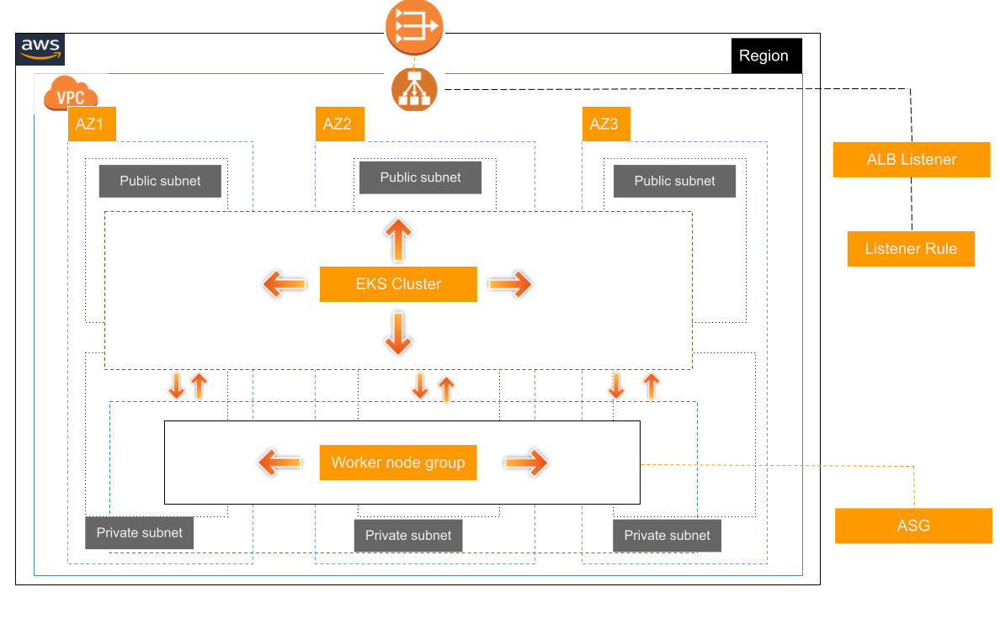

# Elastic Kubernetes Service (EKS)

Terraform module which creates Elastic Kubernetes Service (EKS).
Initializes a EKS cluster along with worker nodes in a node group.

## Diagram



## Requirements

| Name      | Version   |
| --------- | --------- |
| terraform | >= 1.3.4  |
| aws       | >= 4.48.0 |

## Providers

| Name | Version   |
| ---- | --------- |
| aws  | >= 4.48.0 |

| Phase    | Commands                                                        |
| -------- | --------------------------------------------------------------- |
| Planning | `make terraform-plan` **or** `make docker/terraform-plan`       |
| Creation | `make terraform-apply` **or** `make docker/terraform-apply`     |
| Update   | `make terraform-apply` **or** `make docker/terraform-apply`     |
| Deletion | `make terraform-destroy` **or** `make docker/terraform-destroy` |

## Usage

### Eks Cluster

```hcl
module "eks_cluster" {
  source = "./modules/eks-cluster"

  vpc_id                      = var.vpc_id
  eks_cluster_name            = var.eks_cluster_name
  eks_cluster_role_name       = var.eks_cluster_name
  kubernetes_version          = var.kubernetes_version
  subnet_ids                  = var.eks_cluster_subnet_ids
  endpoint_public_access      = var.endpoint_public_access
  endpoint_private_access     = var.endpoint_private_access
  enabled_cluster_log_types   = var.enabled_cluster_log_types
  esk_cluster_default_sg_name = var.esk_cluster_default_sg_name
}
```

### Eks Worker Nodes

```hcl
module "eks_worker_nodes" {
  source = "./modules/eks-worker-nodes"

  # Worker nodes variables.
  cluster_name              = module.eks_cluster.eks_cluster_name
  eks_worker_node_role_name = var.eks_worker_node_role_name
  ec2_ami_image_id          = var.ec2_ami_image_id
  node_group_name           = var.node_group_name
  aws_subnets_ids           = var.eks_worker_subnet_ids
  eks_worker_nodes_labels   = var.eks_worker_nodes_labels

  tags = {
    "Name" : "eks-worker-nodes"
  }
}
```

**NOTE : `terraform.tfvars` file should be created and the above used variables should be initialized it the file.**

## Running locally.

- Make copy of the `terraform.tfvars.example` to `terraform.tfvars` file
- Update the variables as required.
- export `AWS_REGION`, `AWS_ACCESS_KEY_ID` and `AWS_SECRET_KEY` on the terminal.
  ```
  export AWS_REGION=us-east-1
  export AWS_ACCESS_KEY_ID= xxxxxxxxxxxxx
  export AWS_SECRET_KEY= xxxxxxxxxxxxxxx
  ```
- Build the docker image locally
  ```
  make docker-build
  ```
- Run terraform commands

  ```
  # Initialize terraform.

  make terraform-init
  make docker/terraform-init # using docker

  # Show resources to be created.

  make terraform-plan
  make docker/terraform-plan # using docker

  # Create resources.

  make terraform-apply
  make terraform/terraform-apply # using docker

  ```
